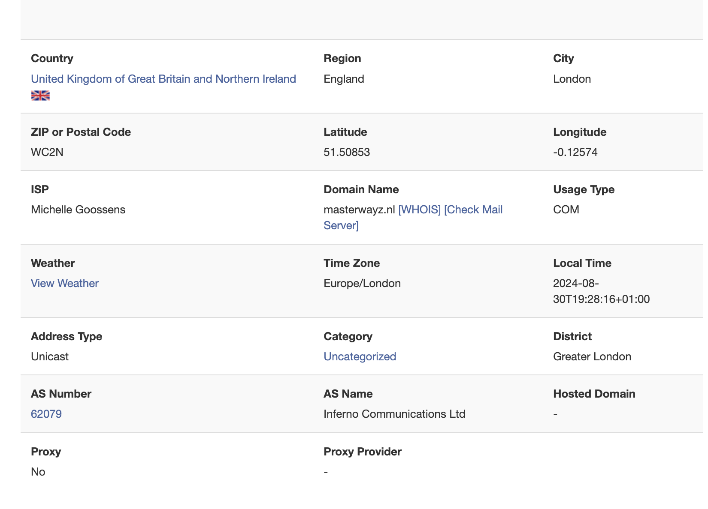

---
**NOTE**

The RIR based way requires a PI inet6num or contact to your sponsor. You have to modify your inet6num object to include new fields which you probably don't have permission for.

---


Your AS is finally working as expected, your home lab now has access to the internet via IPv6 but you have the suspicion that your google results may have changed?

If you're like me, and your geolocation lookup looks like this 


you will notice quiet fast that something is wrong. Your location is assigned as London in the UK even though you have defined a different location for your AS.

In this blog post i'd like to discover and document on how to fix this.

## Geofeed

One way to fix this issue is to provide a geofeed.csv. This can easily be done by creating a simple csv with the following content.

```
# prefix,country_code,region_code,city,postal
2a0f:85c1:892::/48,NL,NL-NH,Amsterdam,

```

This file is as simple as it gets, unfortunately this is where "simple" ends. 
* prefix: For which ip prefix this entry is valid
* country_code: [ISO 3166-1 alpha-2](https://en.wikipedia.org/wiki/List_of_ISO_3166_country_codes#UNI4)
* region_code: [ISO 3166-2](https://en.wikipedia.org/wiki/ISO_3166-2:US) (Replace US with your own country code)
* city: Obvious, which city you want to use as location
* postal: if you want to be even more specific

If you have a bigger file or just want to be sure everything is working, you can validate the csv file

```
python3 -m pip install ipdata
ipdata validate https://example.com/geofeed.csv
static/geofeed.csv has 1 (100.00%) valid entries.
```

The command checks that for every entry:

* the country code is a valid ISO 3166-1 alpha-2 code
* the region code is a valid ISO 3166-2 code
* the region code and the country code match i.e. the region given is in the country given
* the country code is not empty
* the network is a valid network i.e. not a typo or a private/reserved network

### Where to host the geofeed.csv?

You have multiple options available and all of them differ from geolocation provider to the next one. Therefore I will stick to the easiest one for me, your webpage. 

Just place the geofeed.scv in the root of your website and make it available to everyone who needs to access it.

### Announce the geofeed in your inet6num

If you have access to modify your assigned subnet, you can create a `geofeed` entry for your subnet pointing to your new geofeed download URL.
For completenes, i would suggets to also add the old version of this by using a `remark` field with the content `geofeed <url>`


If you can't update RIR records because you do not have permissions, or because you want to speed up the inclusion of your geofeed, you can directly contact geolocation providers. Here is the contact information for the most well-known providers by alphabetic order:

* BigDataCloud: https://www.bigdatacloud.com/update-my-location
* DbIp: https://db-ip.com/report/
* DigitalElement: https://www.digitalelement.com/contact-us/
* Ip2location: https://www.ip2location.com/contact
* IpData: https://ipdata.co/corrections.html
* IpInfo: https://ipinfo.io/corrections
* IpLigence: https://www.ipligence.com/contact
* Ipregistry: https://ipregistry.co/data-corrections
* Maxmind: https://support.maxmind.com/geoip-data-correction-request/
* Neustar: https://www.home.neustar/resources/tools/submit-to-global-ip-database

