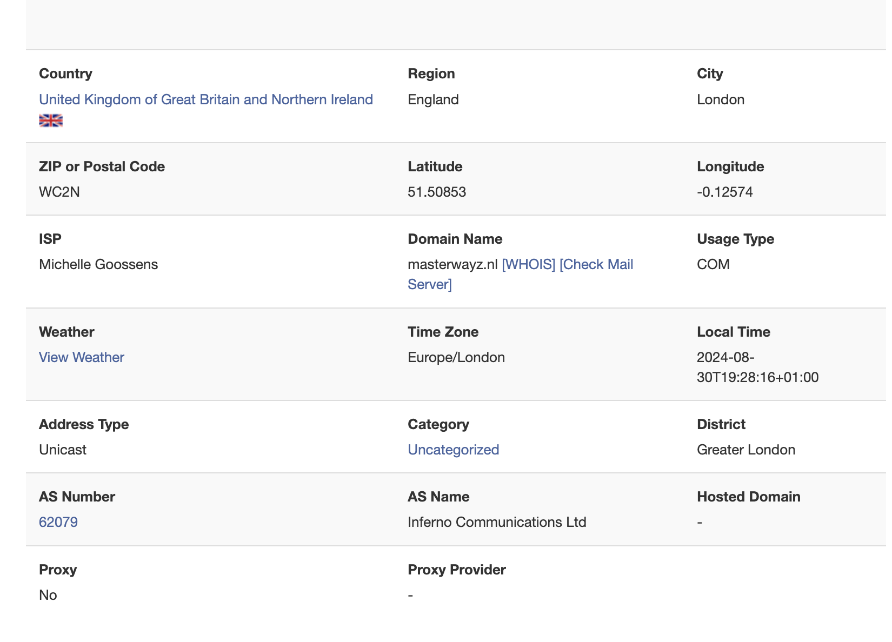

**Note:**  
You will need to modify your `inet6num` object to include new fields, which you might not have the necessary permissions for. Your MNT Handle needs to be set in the mnt-by field.

---

After successfully setting up your Autonomous System (AS) and ensuring your home lab has internet access via IPv6, you might notice that your Google search results have changed. If your geolocation lookup returns results similar to this:



It’s apparent that something is amiss. Despite having defined a different location for your AS, your location is being assigned as London, UK.

In this blog post, I will guide you through the process of correcting this geolocation issue.

## Geofeed

One effective way to address this problem is by creating a `geofeed.csv` file. This can be accomplished by preparing a simple CSV file with the following content:

```
# prefix,country_code,region_code,city,postal
2a0f:85c1:892::/48,NL,NL-NH,Amsterdam,

```


This file is straightforward, but the complexity doesn't end here. Here’s what each field represents:

- **prefix**: The IP prefix to which this entry applies.
- **country_code**: The country code in [ISO 3166-1 alpha-2 format](https://en.wikipedia.org/wiki/List_of_ISO_3166_country_codes#UNI4).
- **region_code**: The region code in [ISO 3166-2 format](https://en.wikipedia.org/wiki/ISO_3166-2:US) (Replace `US` with your country’s code).
- **city**: The city associated with the IP prefix.
- **postal**: The postal code for further specificity (optional).

### Validating the Geofeed CSV

If you have a more extensive file or want to ensure its accuracy, you can validate the CSV file with the following command:

```sh
python3 -m pip install ipdata
ipdata validate https://example.com/geofeed.csv
static/geofeed.csv has 1 (100.00%) valid entries.
```

The command checks that for every entry:

* the country code is a valid ISO 3166-1 alpha-2 code
* the region code is a valid ISO 3166-2 code
* the region code and the country code match i.e. the region given is in the country given
* the country code is not empty
* the network is a valid network i.e. not a typo or a private/reserved network

### Hosting the Geofeed CSV
You have several options for hosting the geofeed.csv file. The choice of hosting location may affect different geolocation providers differently. For simplicity, I recommend hosting it on your website. Place the geofeed.csv file at the root of your site and ensure it’s accessible to those who need it.

### Announcing the Geofeed in Your inet6num
If you have the ability to modify your assigned subnet, create a `geofeed` entry pointing to the download URL of your geofeed.csv. For completeness, it’s advisable to also add a `remark` field containing `geofeed <url>` to reflect the older version.

### Contacting Geolocation Providers Directly
If you cannot update RIR records due to permission restrictions or want to expedite the inclusion of your geofeed, you can contact geolocation providers directly. Below is the contact information for several well-known providers, listed alphabetically:


* BigDataCloud: https://www.bigdatacloud.com/update-my-location
* DbIp: https://db-ip.com/report/
* DigitalElement: https://www.digitalelement.com/contact-us/
* Ip2location: https://www.ip2location.com/contact
* IpData: https://ipdata.co/corrections.html
* IpInfo: https://ipinfo.io/corrections
* IpLigence: https://www.ipligence.com/contact
* Ipregistry: https://ipregistry.co/data-corrections
* Maxmind: https://support.maxmind.com/geoip-data-correction-request/
* Neustar: https://www.home.neustar/resources/tools/submit-to-global-ip-database
